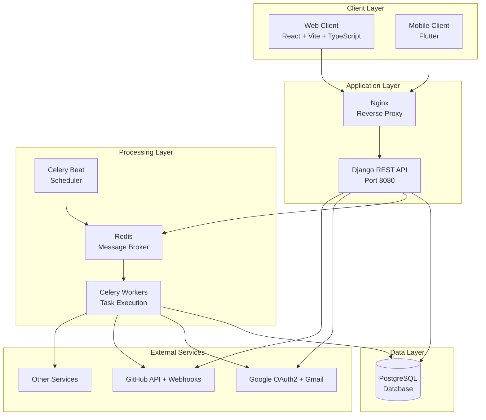
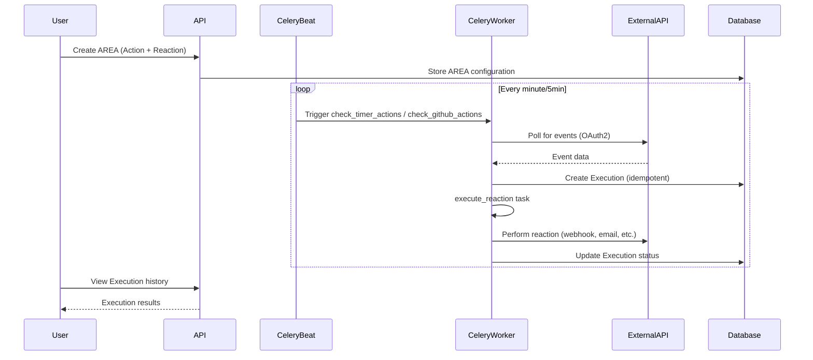

# 🤝 How to Contribute to AREA

Welcome to the AREA (Action-Reaction) project! This guide will help you understand the architecture, set up your development environment, and contribute effectively to the project.

**Table of Contents**

- [1. Architecture Overview](#1-architecture-overview)
- [2. Development Setup](#2-development-setup)
- [3. Adding a New Service](#3-adding-a-new-service)
- [4. Adding an Action](#4-adding-an-action)
- [5. Adding a Reaction](#5-adding-a-reaction)
- [6. Code Standards](#6-code-standards)
- [7. Git Workflow](#7-git-workflow)
- [8. Testing](#8-testing)
- [9. Troubleshooting](#9-troubleshooting)

---

## 1. Architecture Overview

AREA is an automation platform inspired by IFTTT/Zapier, built with a microservices architecture using Docker.

### 1.1 System Architecture



### 1.2 Technology Stack

**Backend**
- **Django 5.2**: Web framework & ORM
- **Django REST Framework**: API endpoints
- **Celery**: Asynchronous task queue
- **Redis**: Message broker & cache
- **PostgreSQL**: Primary database
- **OAuth2**: External service authentication

**Frontend**
- **React 19**: UI library
- **TypeScript**: Type safety
- **Vite**: Build tool
- **Tailwind CSS**: Styling

**Mobile**
- **Flutter**: Cross-platform framework
- **Dart**: Programming language

**DevOps**
- **Docker & Docker Compose**: Containerization
- **GitHub Actions**: CI/CD
- **Ruff**: Python linting & formatting
- **nginx**: Reverse proxy

### 1.3 Data Flow



### 1.4 Core Models

```python
# Simplified model relationships
Service (name, description, status)
  ├── Actions (1-to-many)
  └── Reactions (1-to-many)

Area (user, name, action, reaction, configs, status)
  └── Executions (1-to-many, with idempotency key)

User
  ├── Areas (1-to-many)
  └── ServiceTokens (OAuth2 tokens, 1-to-many)
```

---

## 2. Development Setup

### 2.1 Prerequisites

- **Docker** & **Docker Compose** (v2.0+)
- **Git**
- **Python 3.13+** (for local development)
- **Node.js 20+** (for frontend)
- **Flutter SDK** (for mobile)

### 2.2 Installation Steps

#### Step 1: Clone the Repository

```bash
git clone https://github.com/My-Epitech-Organisation/Area.git
cd Area
```

#### Step 2: Environment Configuration

Create a `.env` file at the project root:

```bash
cp .env.example .env
```

Edit `.env` with your configuration:

```env
# Django
SECRET_KEY=your-super-secret-key-change-in-production
DEBUG=True
ALLOWED_HOSTS=localhost,127.0.0.1

# Database
DB_NAME=area_db
DB_USER=area_user
DB_PASSWORD=area_password
DB_HOST=db
DB_PORT=5432

# Redis
REDIS_HOST=redis
REDIS_PORT=6379
REDIS_URL=redis://redis:6379/0

# Ports
BACKEND_PORT=8080
FRONTEND_PORT=8081

# OAuth2 - Google
GOOGLE_CLIENT_ID=your-google-client-id.apps.googleusercontent.com
GOOGLE_CLIENT_SECRET=your-google-client-secret
GOOGLE_REDIRECT_URI=http://localhost:8080/auth/oauth/google/callback/

# OAuth2 - GitHub
GITHUB_CLIENT_ID=your-github-client-id
GITHUB_CLIENT_SECRET=your-github-client-secret
GITHUB_REDIRECT_URI=http://localhost:8080/auth/oauth/github/callback/

# Email (optional, for send_email reaction)
EMAIL_HOST=smtp.gmail.com
EMAIL_PORT=587
EMAIL_HOST_USER=your-email@gmail.com
EMAIL_HOST_PASSWORD=your-app-password
```

#### Step 3: Build and Start Services

```bash
# Build all containers
docker-compose build

# Start all services
docker-compose up -d

# Check logs
docker-compose logs -f
```

#### Step 4: Initialize Database

```bash
# Run migrations
docker-compose exec server python manage.py migrate

# Create superuser
docker-compose exec server python manage.py createsuperuser

# Initialize services (IMPORTANT!)
docker-compose exec server python manage.py init_services
```

Or use the Makefile:

```bash
make build      # Build containers
make up         # Start services
make init-db    # Initialize services
```

#### Step 5: Verify Installation

- Backend API: http://localhost:8080/api/
- Admin panel: http://localhost:8080/admin/
- Frontend: http://localhost:8081/
- API docs: http://localhost:8080/about.json

---

## 3. Adding a New Service

A **Service** represents an external platform (e.g., GitHub, Gmail, Slack) that provides actions and reactions.

### 3.1 Step-by-Step Guide

#### Step 1: Define the Service

Add your service to `backend/automations/management/commands/init_services.py`:

```python
def _create_slack_service(self):
    """Create Slack service with actions and reactions."""
    service, created = Service.objects.get_or_create(
        name="slack",
        defaults={
            "description": "Send messages and manage Slack workspace",
            "status": Service.Status.ACTIVE,
        },
    )

    if created:
        self.stdout.write(self.style.SUCCESS(f"  ✓ Created service: {service.name}"))
    else:
        self.stdout.write(f"  → Service already exists: {service.name}")

    # Create actions
    self._create_action(
        service=service,
        name="slack_new_message",
        description="Triggered when a new message is posted in a channel"
    )

    # Create reactions
    self._create_reaction(
        service=service,
        name="slack_send_message",
        description="Send a message to a Slack channel"
    )

    return service
```

Then add to `_create_services()`:

```python
def _create_services(self):
    # ... existing services
    self._create_slack_service()
```

#### Step 2: Define JSON Schemas

Add schemas in `backend/automations/validators.py`:

```python
ACTION_SCHEMAS = {
    # ... existing schemas
    "slack_new_message": {
        "type": "object",
        "properties": {
            "channel": {
                "type": "string",
                "description": "Slack channel ID or name",
            },
            "keyword": {
                "type": "string",
                "description": "Filter messages containing this keyword (optional)",
            },
        },
        "required": ["channel"],
        "additionalProperties": False,
    },
}

REACTION_SCHEMAS = {
    # ... existing schemas
    "slack_send_message": {
        "type": "object",
        "properties": {
            "channel": {
                "type": "string",
                "description": "Target channel ID or name",
            },
            "message": {
                "type": "string",
                "description": "Message to send",
            },
            "username": {
                "type": "string",
                "description": "Bot display name (optional)",
            },
        },
        "required": ["channel", "message"],
        "additionalProperties": False,
    },
}
```

#### Step 3: Add Compatibility Rules

Update `COMPATIBILITY_RULES` in `validators.py`:

```python
COMPATIBILITY_RULES = {
    # ... existing rules
    "slack_new_message": [
        "slack_send_message",
        "send_email",
        "webhook_post",
        "log_message",
    ],
}
```

#### Step 4: Test the Service

```bash
# Reset and reinitialize
docker-compose exec server python manage.py init_services --reset

# Verify in admin panel
open http://localhost:8080/admin/automations/service/

# Check API
curl http://localhost:8080/api/services/ | jq '.results[] | select(.name=="slack")'
```

### 3.2 Validation Checklist

- [ ] Service created with clear name and description
- [ ] At least 1 action defined
- [ ] At least 1 reaction defined
- [ ] JSON schemas added for action/reaction configs
- [ ] Compatibility rules updated
- [ ] Service appears in admin panel
- [ ] Service accessible via API
- [ ] Documentation updated

---

## 4. Adding an Action

An **Action** is a trigger that starts an automation (e.g., "new GitHub issue", "timer at 9 AM").

### 4.1 Implementation Guide

#### Step 1: Define the Action

Already covered in section 3 (add to `init_services.py`).

#### Step 2: Implement the Check Task

Create or update the task in `backend/automations/tasks.py`:

```python
@shared_task(
    name="automations.check_slack_actions",
    bind=True,
    max_retries=3,
    default_retry_delay=300,
)
def check_slack_actions(self):
    """
    Check Slack-based actions (polling mode).

    Polls Slack API for new messages matching user's AREA configurations.
    Runs every 5 minutes via Celery Beat.

    Returns:
        dict: Statistics about processed events
    """
    logger.info("Starting Slack actions check (polling)")

    triggered_count = 0
    skipped_count = 0
    no_token_count = 0

    try:
        from users.oauth.manager import OAuthManager

        # Get all active areas with Slack actions
        slack_areas = get_active_areas(["slack_new_message"])

        logger.debug(f"Found {len(slack_areas)} active Slack areas")

        for area in slack_areas:
            try:
                # Get valid OAuth2 token for the user
                access_token = OAuthManager.get_valid_token(area.owner, "slack")

                if not access_token:
                    logger.warning(
                        f"No valid Slack token for user {area.owner.email}, "
                        f"skipping area '{area.name}'"
                    )
                    no_token_count += 1
                    continue

                # Extract configuration
                channel = area.action_config.get("channel")
                keyword = area.action_config.get("keyword")

                # Call Slack API
                headers = {"Authorization": f"Bearer {access_token}"}
                response = requests.get(
                    f"https://slack.com/api/conversations.history",
                    headers=headers,
                    params={"channel": channel, "limit": 10},
                    timeout=30,
                )

                if response.status_code != 200:
                    logger.error(f"Slack API error: {response.status_code}")
                    continue

                data = response.json()
                if not data.get("ok"):
                    logger.error(f"Slack API error: {data.get('error')}")
                    continue

                # Process messages
                for message in data.get("messages", []):
                    # Filter by keyword if specified
                    if keyword and keyword.lower() not in message.get("text", "").lower():
                        continue

                    # Create unique event ID
                    event_id = f"slack_message_{message['ts']}"

                    # Create execution (idempotent)
                    execution, created = create_execution_safe(
                        area=area,
                        external_event_id=event_id,
                        trigger_data={
                            "message": message.get("text"),
                            "user": message.get("user"),
                            "timestamp": message.get("ts"),
                            "channel": channel,
                        },
                    )

                    if created and execution:
                        # Queue the reaction
                        execute_reaction.delay(execution.pk)
                        triggered_count += 1
                        logger.info(f"Triggered execution #{execution.pk} for Slack message")
                    else:
                        skipped_count += 1

            except Exception as e:
                logger.error(f"Error checking Slack area '{area.name}': {e}", exc_info=True)
                continue

        logger.info(
            f"Slack check complete: {triggered_count} triggered, "
            f"{skipped_count} skipped, {no_token_count} no token"
        )

        return {
            "status": "success",
            "triggered": triggered_count,
            "skipped": skipped_count,
            "no_token": no_token_count,
        }

    except Exception as exc:
        logger.error(f"Fatal error in check_slack_actions: {exc}", exc_info=True)
        raise self.retry(exc=exc, countdown=300) from None
```

#### Step 3: Schedule the Task

Add to `backend/area_project/settings.py`:

```python
CELERY_BEAT_SCHEDULE = {
    # ... existing tasks
    "check-slack-actions": {
        "task": "automations.check_slack_actions",
        "schedule": crontab(minute="*/5"),  # Every 5 minutes
        "options": {"queue": "slack"},
    },
}
```

#### Step 4: Add Task Route

```python
CELERY_TASK_ROUTES = {
    # ... existing routes
    "automations.check_slack_actions": {"queue": "slack"},
}
```

### 4.2 Testing Actions

```python
# backend/automations/tests/test_slack_actions.py
from unittest.mock import MagicMock, patch
from django.test import TestCase
from automations.models import Area, Service, Action, Reaction
from automations.tasks import check_slack_actions
from users.models import User

class CheckSlackActionsTest(TestCase):
    def setUp(self):
        self.user = User.objects.create_user(
            username="testuser",
            email="test@example.com",
            password="testpass123"
        )

        # Create Slack service
        self.slack_service = Service.objects.create(
            name="slack",
            description="Slack integration"
        )

        self.slack_action = Action.objects.create(
            service=self.slack_service,
            name="slack_new_message",
            description="New Slack message"
        )

        self.email_reaction = Reaction.objects.create(
            service=Service.objects.create(name="email"),
            name="send_email",
            description="Send email"
        )

    @patch("automations.tasks.OAuthManager.get_valid_token")
    @patch("automations.tasks.requests.get")
    def test_check_slack_actions_success(self, mock_get, mock_token):
        # Mock OAuth token
        mock_token.return_value = "test_slack_token"

        # Mock Slack API response
        mock_response = MagicMock()
        mock_response.status_code = 200
        mock_response.json.return_value = {
            "ok": True,
            "messages": [
                {
                    "text": "Hello world",
                    "user": "U123",
                    "ts": "1234567890.123456"
                }
            ]
        }
        mock_get.return_value = mock_response

        # Create AREA
        area = Area.objects.create(
            owner=self.user,
            name="Test Slack AREA",
            action=self.slack_action,
            reaction=self.email_reaction,
            action_config={"channel": "C123"},
            status=Area.Status.ACTIVE
        )

        # Run task
        result = check_slack_actions()

        # Assertions
        self.assertEqual(result["status"], "success")
        self.assertEqual(result["triggered"], 1)
        mock_token.assert_called_once_with(self.user, "slack")
```

### 4.3 Validation Checklist

- [ ] Check task implemented in `tasks.py`
- [ ] Task scheduled in Celery Beat
- [ ] OAuth2 token retrieval (if needed)
- [ ] Idempotency implemented (unique event IDs)
- [ ] Error handling with retries
- [ ] Logging at INFO/DEBUG/ERROR levels
- [ ] Unit tests written and passing
- [ ] Task appears in Celery logs

---

## 5. Adding a Reaction

A **Reaction** is the automated action performed when an Action triggers (e.g., "send email", "post to Slack").

### 5.1 Implementation Guide

#### Step 1: Define the Reaction

Already covered in section 3 (add to `init_services.py`).

#### Step 2: Implement the Reaction Logic

Update `execute_reaction` task in `backend/automations/tasks.py`:

```python
@shared_task(
    name="automations.execute_reaction_task",
    bind=True,
    max_retries=3,
    default_retry_delay=60,
    autoretry_for=RECOVERABLE_EXCEPTIONS,
)
def execute_reaction(self, execution_id: int):
    """
    Execute a reaction for a given execution.

    This is the main entry point for all reaction executions.
    """
    try:
        execution = Execution.objects.select_related(
            "area", "area__reaction", "area__owner"
        ).get(pk=execution_id)
    except Execution.DoesNotExist:
        logger.error(f"Execution #{execution_id} not found")
        return

    # Update status to running
    execution.status = Execution.Status.RUNNING
    execution.started_at = timezone.now()
    execution.save(update_fields=["status", "started_at"])

    reaction_name = execution.area.reaction.name
    reaction_config = execution.area.reaction_config

    try:
        # Route to appropriate handler
        if reaction_name == "slack_send_message":
            result = _execute_slack_message(execution, reaction_config)
        elif reaction_name == "send_email":
            result = _execute_send_email(execution, reaction_config)
        elif reaction_name == "webhook_post":
            result = _execute_webhook(execution, reaction_config)
        else:
            raise ValueError(f"Unknown reaction type: {reaction_name}")

        # Mark as successful
        execution.status = Execution.Status.SUCCESS
        execution.completed_at = timezone.now()
        execution.result_data = result
        execution.save(update_fields=["status", "completed_at", "result_data"])

        logger.info(f"✅ Execution #{execution_id} completed successfully")

    except Exception as e:
        execution.status = Execution.Status.FAILED
        execution.completed_at = timezone.now()
        execution.error_message = str(e)
        execution.save(update_fields=["status", "completed_at", "error_message"])

        logger.error(f"❌ Execution #{execution_id} failed: {e}", exc_info=True)
        raise


def _execute_slack_message(execution, config):
    """Execute Slack message reaction."""
    from users.oauth.manager import OAuthManager

    # Get OAuth token
    access_token = OAuthManager.get_valid_token(execution.area.owner, "slack")
    if not access_token:
        raise ValueError("No valid Slack token available")

    # Extract config
    channel = config.get("channel")
    message = config.get("message")
    username = config.get("username", "AREA Bot")

    # Optionally, replace placeholders with trigger data
    trigger_data = execution.trigger_data or {}
    message = message.format(**trigger_data)

    # Send to Slack
    response = requests.post(
        "https://slack.com/api/chat.postMessage",
        headers={
            "Authorization": f"Bearer {access_token}",
            "Content-Type": "application/json",
        },
        json={
            "channel": channel,
            "text": message,
            "username": username,
        },
        timeout=30,
    )

    if response.status_code != 200:
        raise Exception(f"Slack API error: {response.status_code} - {response.text}")

    data = response.json()
    if not data.get("ok"):
        raise Exception(f"Slack API error: {data.get('error')}")

    logger.info(f"Slack message sent to {channel}: {message[:50]}...")

    return {
        "channel": channel,
        "message_ts": data.get("ts"),
        "success": True,
    }
```

### 5.2 Testing Reactions

```python
# backend/automations/tests/test_slack_reactions.py
from unittest.mock import patch, MagicMock
from django.test import TestCase
from automations.models import Area, Execution, Service, Action, Reaction
from automations.tasks import execute_reaction, _execute_slack_message
from users.models import User

class SlackReactionTest(TestCase):
    def setUp(self):
        self.user = User.objects.create_user(
            username="testuser",
            email="test@example.com"
        )

        # Create services
        slack_service = Service.objects.create(name="slack")
        timer_service = Service.objects.create(name="timer")

        # Create action and reaction
        self.timer_action = Action.objects.create(
            service=timer_service,
            name="timer_daily"
        )
        self.slack_reaction = Reaction.objects.create(
            service=slack_service,
            name="slack_send_message"
        )

        # Create AREA
        self.area = Area.objects.create(
            owner=self.user,
            name="Test AREA",
            action=self.timer_action,
            reaction=self.slack_reaction,
            reaction_config={
                "channel": "C123",
                "message": "Test message: {action_type}"
            }
        )

        # Create execution
        self.execution = Execution.objects.create(
            area=self.area,
            external_event_id="test_event_123",
            status=Execution.Status.PENDING,
            trigger_data={"action_type": "timer_daily"}
        )

    @patch("automations.tasks.OAuthManager.get_valid_token")
    @patch("automations.tasks.requests.post")
    def test_execute_slack_message_success(self, mock_post, mock_token):
        # Mock OAuth token
        mock_token.return_value = "test_slack_token"

        # Mock Slack API
        mock_response = MagicMock()
        mock_response.status_code = 200
        mock_response.json.return_value = {
            "ok": True,
            "ts": "1234567890.123456"
        }
        mock_post.return_value = mock_response

        # Execute reaction
        execute_reaction(self.execution.pk)

        # Refresh from DB
        self.execution.refresh_from_db()

        # Assertions
        self.assertEqual(self.execution.status, Execution.Status.SUCCESS)
        self.assertIsNotNone(self.execution.completed_at)
        self.assertIn("success", self.execution.result_data)
        mock_token.assert_called_once()
        mock_post.assert_called_once()
```

### 5.3 Validation Checklist

- [ ] Reaction handler function implemented
- [ ] OAuth2 token retrieval (if needed)
- [ ] Configuration validation
- [ ] Error handling and logging
- [ ] Result data stored in execution
- [ ] Unit tests written and passing
- [ ] Integration test with real API (optional)

---

## 6. Code Standards

### 6.1 Python (Backend)

We use **Ruff** for linting and formatting, which replaces Black, flake8, and isort.

#### Configuration

See `backend/pyproject.toml`:

```toml
[tool.ruff]
line-length = 88
target-version = "py313"

[tool.ruff.lint]
select = [
    "E",   # pycodestyle errors
    "W",   # pycodestyle warnings
    "F",   # Pyflakes
    "B",   # flake8-bugbear
    "C4",  # flake8-comprehensions
    "SIM", # flake8-simplify
    "DJ",  # flake8-django
    "I",   # isort import sorting
]
```

#### Running Linters

```bash
# Check for issues
cd backend
./scripts/lint-check.sh

# Auto-fix issues
./scripts/lint-fix.sh

# Or with Make
make lint-check
make lint-fix
```

### 6.2 Naming Conventions

**Python**
- Classes: `PascalCase` (e.g., `ServiceViewSet`, `OAuthManager`)
- Functions/methods: `snake_case` (e.g., `create_execution_safe`, `get_valid_token`)
- Constants: `UPPER_SNAKE_CASE` (e.g., `CELERY_BEAT_SCHEDULE`, `MAX_RETRIES`)
- Private methods: `_leading_underscore` (e.g., `_execute_webhook`)

**Models**
- Singular names: `Service`, `Action`, `Reaction`, `Area`, `Execution`
- Related names: `service.actions`, `area.executions`

**API Endpoints**
- Lowercase with hyphens: `/api/services/`, `/api/areas/`, `/auth/oauth/google/`

**Git Branches**
- Feature: `feature/add-slack-integration`
- Bugfix: `bugfix/fix-timer-timezone`
- Hotfix: `hotfix/critical-oauth-bug`
- Task: `28-feature-frontend-react-servicePage-gmail-component`

### 6.3 Code Structure

**File Organization**
```
backend/
├── area_project/          # Django project settings
│   ├── settings.py
│   ├── urls.py
│   └── celery.py
├── automations/           # Main app
│   ├── models.py          # Database models
│   ├── serializers.py     # API serializers
│   ├── views.py           # API views
│   ├── tasks.py           # Celery tasks
│   ├── validators.py      # JSON schemas
│   ├── webhooks.py        # Webhook handlers
│   └── management/
│       └── commands/
│           └── init_services.py
├── users/                 # Authentication app
│   ├── models.py
│   ├── oauth/             # OAuth2 providers
│   │   ├── manager.py
│   │   ├── google.py
│   │   └── github.py
│   └── oauth_views.py
└── tests/                 # Test files
    ├── test_models.py
    ├── test_views.py
    └── test_tasks.py
```

### 6.4 Documentation Strings

Use Google-style docstrings:

```python
def create_execution_safe(
    area: Area, external_event_id: str, trigger_data: dict
) -> tuple[Optional[Execution], bool]:
    """
    Safely create an Execution with idempotency.

    This function prevents duplicate executions by using get_or_create
    with a unique external_event_id. If an execution with the same
    event ID already exists, it returns None.

    Args:
        area: The Area to execute
        external_event_id: Unique identifier for this event (e.g., "github_issue_123")
        trigger_data: Data from the trigger event (stored as JSON)

    Returns:
        tuple: (Execution instance or None, was_created boolean)
               Returns (None, False) if duplicate detected

    Example:
        >>> execution, created = create_execution_safe(
        ...     area=my_area,
        ...     external_event_id="timer_123_202501010900",
        ...     trigger_data={"timestamp": "2025-01-01T09:00:00Z"}
        ... )
        >>> if created:
        ...     execute_reaction.delay(execution.pk)
    """
    try:
        execution, created = Execution.objects.get_or_create(
            area=area,
            external_event_id=external_event_id,
            defaults={
                "status": Execution.Status.PENDING,
                "trigger_data": trigger_data,
            },
        )
        return execution, created
    except IntegrityError:
        return None, False
```

### 6.5 Commit Messages

Follow Conventional Commits:

```
<type>(<scope>): <subject>

<body>

<footer>
```

**Types:**
- `feat`: New feature
- `fix`: Bug fix
- `docs`: Documentation changes
- `style`: Code style changes (formatting)
- `refactor`: Code refactoring
- `test`: Adding/updating tests
- `chore`: Maintenance tasks

**Examples:**

```
feat(automations): add Slack integration with OAuth2

- Implement slack_new_message action
- Implement slack_send_message reaction
- Add Slack OAuth2 provider
- Add Celery task for polling Slack API
- Add unit tests for Slack integration

Closes #42
```

```
fix(tasks): prevent duplicate executions with better idempotency

Use get_or_create with external_event_id to ensure
only one execution per unique event.

Fixes #58
```

---

## 7. Git Workflow

### 7.1 Branch Strategy

We use **Git Flow** with the following branches:

- `main`: Production-ready code
- `dev`: Development integration branch (optional)
- `feature/*`: New features
- `bugfix/*`: Bug fixes
- `hotfix/*`: Critical production fixes

### 7.2 Creating a Feature

```bash
# 1. Update main branch
git checkout main
git pull origin main

# 2. Create feature branch
git checkout -b feature/add-discord-integration

# 3. Make changes and commit
git add .
git commit -m "feat(automations): add Discord integration"

# 4. Push to remote
git push -u origin feature/add-discord-integration

# 5. Create Pull Request on GitHub
```

### 7.3 Pull Request Process

1. **Create PR** with descriptive title and description
2. **Link Issues**: Reference related issues (e.g., "Closes #42")
3. **Request Reviewers**: Assign team members
4. **CI Checks**: Ensure all checks pass (linting, tests, build)
5. **Code Review**: Address feedback
6. **Merge**: Squash and merge or rebase

**PR Template:**

```markdown
## Description
Brief description of changes

## Type of Change
- [ ] Bug fix
- [ ] New feature
- [ ] Breaking change
- [ ] Documentation update

## Checklist
- [ ] Code follows style guidelines
- [ ] Self-review performed
- [ ] Comments added for complex code
- [ ] Documentation updated
- [ ] Tests added/updated
- [ ] All tests pass
- [ ] No new warnings

## Testing
How to test these changes

## Screenshots (if applicable)
```

### 7.4 CI/CD Pipeline

Our GitHub Actions workflow (`.github/workflows/ci.yml`) runs on every push:

**Backend CI:**
1. Setup Python 3.13
2. Install dependencies
3. Run Ruff linting
4. Build Docker image
5. (Optional) Run tests

**Frontend CI:**
1. Setup Node.js 20
2. Install dependencies
3. Build production bundle

**Mobile CI:**
1. Setup Flutter
2. Build APK
3. Copy to shared volume

---

## 8. Testing

### 8.1 Test Structure

```
backend/automations/tests/
├── __init__.py
├── test_models.py          # Model tests
├── test_serializers.py     # API serializer tests
├── test_views.py           # API view tests
├── test_tasks.py           # Celery task tests
├── test_timer_actions.py   # Specific action tests
└── test_validators.py      # Validation tests
```

### 8.2 Writing Unit Tests

```python
# backend/automations/tests/test_models.py
from django.test import TestCase
from automations.models import Service, Action, Reaction, Area
from users.models import User

class ServiceModelTest(TestCase):
    """Test Service model."""

    def setUp(self):
        """Set up test data."""
        self.service = Service.objects.create(
            name="test_service",
            description="Test service description",
            status=Service.Status.ACTIVE
        )

    def test_service_creation(self):
        """Test creating a service."""
        self.assertEqual(self.service.name, "test_service")
        self.assertEqual(self.service.status, Service.Status.ACTIVE)

    def test_service_str(self):
        """Test service string representation."""
        self.assertEqual(str(self.service), "test_service")

    def test_service_actions_relationship(self):
        """Test service has many actions."""
        action1 = Action.objects.create(
            service=self.service,
            name="test_action_1",
            description="Test action 1"
        )
        action2 = Action.objects.create(
            service=self.service,
            name="test_action_2",
            description="Test action 2"
        )

        self.assertEqual(self.service.actions.count(), 2)
        self.assertIn(action1, self.service.actions.all())
        self.assertIn(action2, self.service.actions.all())
```

### 8.3 Testing API Endpoints

```python
# backend/automations/tests/test_views.py
from rest_framework.test import APITestCase
from rest_framework import status
from automations.models import Service
from users.models import User

class ServiceViewSetTest(APITestCase):
    """Test ServiceViewSet API."""

    def setUp(self):
        """Set up test user and authenticate."""
        self.user = User.objects.create_user(
            username="testuser",
            email="test@example.com",
            password="testpass123"
        )
        self.client.force_authenticate(user=self.user)

        self.service = Service.objects.create(
            name="github",
            description="GitHub integration",
            status=Service.Status.ACTIVE
        )

    def test_list_services(self):
        """Test listing services."""
        response = self.client.get("/api/services/")

        self.assertEqual(response.status_code, status.HTTP_200_OK)
        self.assertEqual(len(response.data["results"]), 1)
        self.assertEqual(response.data["results"][0]["name"], "github")

    def test_retrieve_service(self):
        """Test retrieving a specific service."""
        response = self.client.get(f"/api/services/{self.service.pk}/")

        self.assertEqual(response.status_code, status.HTTP_200_OK)
        self.assertEqual(response.data["name"], "github")
```

### 8.4 Running Tests

```bash
# Run all tests
docker-compose exec server python manage.py test

# Run specific app tests
docker-compose exec server python manage.py test automations

# Run specific test file
docker-compose exec server python manage.py test automations.tests.test_models

# Run specific test class
docker-compose exec server python manage.py test automations.tests.test_models.ServiceModelTest

# Run with verbosity
docker-compose exec server python manage.py test --verbosity=2

# Run with coverage
docker-compose exec server coverage run --source='.' manage.py test
docker-compose exec server coverage report
docker-compose exec server coverage html  # Generate HTML report
```

### 8.5 Coverage Requirements

- **Minimum coverage**: 70%
- **Target coverage**: 80%+
- **Critical paths**: 90%+ (authentication, execution flow)

View coverage report:
```bash
docker-compose exec server coverage html
open backend/htmlcov/index.html
```

---

## 9. Troubleshooting

### 9.1 Common Issues

#### Issue: Docker containers won't start

**Symptoms:**
```
Error: Cannot start service server: driver failed programming external connectivity
```

**Solutions:**
1. Check if ports are already in use:
   ```bash
   lsof -i :8080
   lsof -i :8081
   ```

2. Stop conflicting services:
   ```bash
   docker-compose down
   docker system prune -a
   ```

3. Change ports in `.env`:
   ```env
   BACKEND_PORT=8090
   FRONTEND_PORT=8091
   ```

#### Issue: Database migrations fail

**Symptoms:**
```
django.db.utils.ProgrammingError: relation "automations_service" does not exist
```

**Solutions:**
1. Reset database:
   ```bash
   docker-compose down -v
   docker-compose up -d db
   docker-compose exec server python manage.py migrate
   ```

2. Create migrations if missing:
   ```bash
   docker-compose exec server python manage.py makemigrations
   docker-compose exec server python manage.py migrate
   ```

#### Issue: Celery tasks not running

**Symptoms:**
- No executions created
- No logs from Celery worker

**Solutions:**
1. Check Celery services are running:
   ```bash
   docker-compose ps
   ```

2. Check Celery logs:
   ```bash
   docker-compose logs -f worker
   docker-compose logs -f beat
   ```

3. Verify Celery Beat schedule:
   ```bash
   docker-compose exec beat celery -A area_project inspect scheduled
   ```

4. Manually trigger task:
   ```bash
   docker-compose exec server python manage.py shell
   >>> from automations.tasks import check_timer_actions
   >>> check_timer_actions.delay()
   ```

#### Issue: OAuth2 authentication fails

**Symptoms:**
```
OAuthError: Token exchange failed
```

**Solutions:**
1. Verify OAuth2 credentials in `.env`:
   ```bash
   echo $GOOGLE_CLIENT_ID
   echo $GOOGLE_CLIENT_SECRET
   ```

2. Check redirect URI matches:
   - Google Console: http://localhost:8080/auth/oauth/google/callback/
   - `.env`: GOOGLE_REDIRECT_URI=http://localhost:8080/auth/oauth/google/callback/

3. Test OAuth2 flow:
   ```bash
   curl -X GET http://localhost:8080/auth/oauth/google/ \
     -H "Authorization: Bearer YOUR_JWT_TOKEN"
   ```

#### Issue: Frontend not connecting to backend

**Symptoms:**
- CORS errors in browser console
- API calls return 404

**Solutions:**
1. Verify backend URL in frontend config:
   ```typescript
   // frontend/src/utils/api.ts
   const API_BASE_URL = import.meta.env.VITE_API_URL || 'http://localhost:8080';
   ```

2. Check CORS settings in `backend/area_project/settings.py`:
   ```python
   CORS_ALLOWED_ORIGINS = [
       "http://localhost:8081",
       "http://localhost:5173",  # Vite dev server
   ]
   ```

3. Test API manually:
   ```bash
   curl http://localhost:8080/about.json
   ```

### 9.2 Debugging Tips

**Check Logs:**
```bash
# All services
docker-compose logs -f

# Specific service
docker-compose logs -f server
docker-compose logs -f worker
docker-compose logs -f beat

# Last 100 lines
docker-compose logs --tail=100 server
```

**Access Django Shell:**
```bash
docker-compose exec server python manage.py shell

# Then in Python:
>>> from automations.models import Service, Area, Execution
>>> Service.objects.all()
>>> Area.objects.filter(status='active')
```

**Access Database:**
```bash
docker-compose exec db psql -U area_user -d area_db

# Then in PostgreSQL:
\dt                          -- List tables
SELECT * FROM automations_service;
SELECT * FROM automations_area WHERE status = 'active';
```

**Monitor Celery:**
```bash
# Via Flower (web UI)
open http://localhost:5555

# Via CLI
docker-compose exec worker celery -A area_project inspect active
docker-compose exec worker celery -A area_project inspect stats
```

### 9.3 Where to Find Logs

- **Django logs**: `backend/logs/django.log`
- **Celery logs**: `docker-compose logs worker beat`
- **PostgreSQL logs**: `docker-compose logs db`
- **nginx logs**: `docker-compose logs client_web`
- **Frontend logs**: Browser console (F12)

### 9.4 Performance Issues

**Slow API responses:**
```python
# Add Django Debug Toolbar (dev only)
# backend/requirements-dev.txt
django-debug-toolbar

# Check database queries
>>> from django.db import connection
>>> print(len(connection.queries))
>>> print(connection.queries[-1])
```

**High memory usage:**
```bash
# Check container stats
docker stats

# Limit container resources in docker-compose.yml
services:
  worker:
    deploy:
      resources:
        limits:
          memory: 512M
```

---

## 10. Resources & References

### Documentation
- [Django Documentation](https://docs.djangoproject.com/)
- [Django REST Framework](https://www.django-rest-framework.org/)
- [Celery Documentation](https://docs.celeryproject.org/)
- [React Documentation](https://react.dev/)
- [Flutter Documentation](https://flutter.dev/docs)

### Project-Specific Docs
- [OAuth2 Integration Guide](backend/docs/OAUTH2.md)
- [Docker Compose Guide](docs/docker-compose.md)
- [MVP Development Plan](MVP_DEVELOPMENT_PLAN.md)

### Internal Tools
- Admin Panel: http://localhost:8080/admin/
- API Root: http://localhost:8080/api/
- Flower (Celery): http://localhost:5555/
- About.json: http://localhost:8080/about.json

---

## 🎉 You're Ready to Contribute!

Thank you for contributing to AREA! If you have questions:

1. Check this guide
2. Review existing code and tests
3. Ask in team chat or GitHub Discussions
4. Open an issue if you find a bug

**Happy coding!** 🚀
