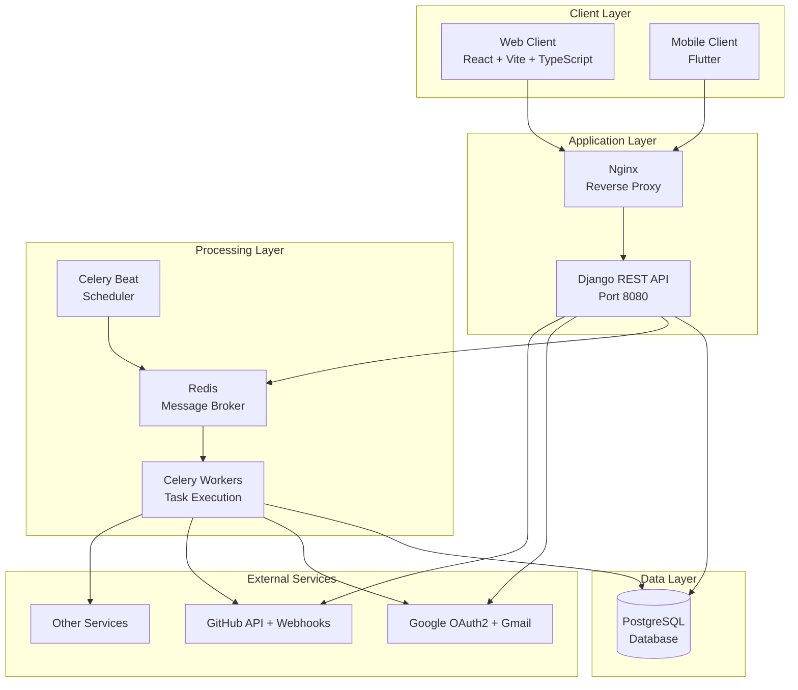
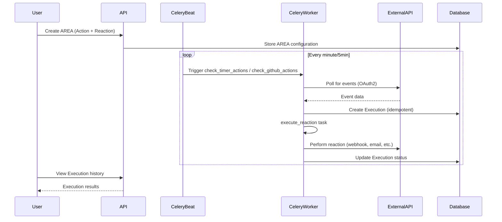
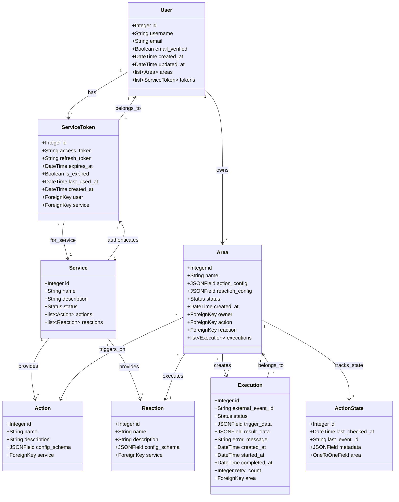
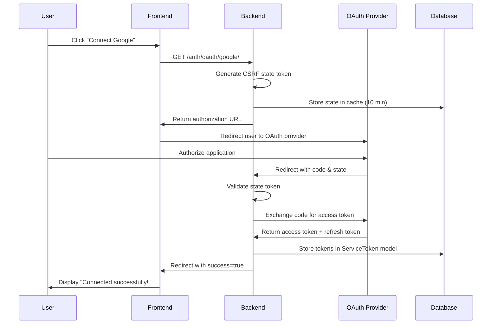

# 🤝 How to Contribute to AREA

Welcome to the AREA (Action-Reaction) project! This guide will help you understand the architecture, set up your development environment, and contribute effectively to the project.

**Table of Contents**

- [1. Architecture Overview](#1-architecture-overview)
- [2. Development Setup](#2-development-setup)
- [3. Adding a New Service](#3-adding-a-new-service)
- [4. Adding an Action](#4-adding-an-action)
- [5. Adding a Reaction](#5-adding-a-reaction)
- [6. OAuth2 Integration](#6-oauth2-integration)
- [7. Code Standards](#7-code-standards)
- [8. Git Workflow](#8-git-workflow)
- [9. Testing](#9-testing)
- [10. Troubleshooting](#10-troubleshooting)

---

## 1. Architecture Overview

AREA is an automation platform inspired by IFTTT/Zapier, built with a microservices architecture using Docker.

### 1.1 System Architecture



### 1.2 Technology Stack

**Backend**
- **Django 5.2**: Web framework & ORM
- **Django REST Framework**: API endpoints
- **Celery**: Asynchronous task queue
- **Redis**: Message broker & cache
- **PostgreSQL**: Primary database
- **OAuth2**: External service authentication

**Frontend**
- **React 19**: UI library
- **TypeScript**: Type safety
- **Vite**: Build tool
- **Tailwind CSS**: Styling

**Mobile**
- **Flutter**: Cross-platform framework
- **Dart**: Programming language

**DevOps**
- **Docker & Docker Compose**: Containerization
- **GitHub Actions**: CI/CD
- **Ruff**: Python linting & formatting
- **nginx**: Reverse proxy

### 1.3 Data Flow



### 1.4 Core Models

#### Class Diagram



#### Model Relationships Summary

```python
# Simplified model relationships
Service (name, description, status)
  ├── Actions (1-to-many)
  └── Reactions (1-to-many)

Area (user, name, action, reaction, configs, status)
  ├── Executions (1-to-many, with idempotency key)
  └── ActionState (1-to-1, for polling state)

User
  ├── Areas (1-to-many)
  └── ServiceTokens (OAuth2 tokens, 1-to-many)
```

---

## 2. Development Setup

### 2.1 Prerequisites

- **Docker** & **Docker Compose** (v2.0+)
- **Git**
- **Python 3.13+** (for local development)
- **Node.js 20+** (for frontend)
- **Flutter SDK** (for mobile)

### 2.2 Installation Steps

#### Step 1: Clone the Repository

```bash
git clone https://github.com/My-Epitech-Organisation/Area.git
cd Area
```

#### Step 2: Environment Configuration

**🎯 IMPORTANT: Centralized Environment Variables**

All environment variables are managed from a **single `.env` file at the project root**. This file is shared by all services (backend, frontend, mobile) through Docker Compose.

**Setup:**

```bash
# Copy the template
cp .env.example .env

# Edit with your values
nano .env  # or your preferred editor

# Validate your configuration
./scripts/validate-env.sh
```

**Configuration Files:**
- `.env` - Your local development configuration (gitignored, contains secrets)
- `.env.example` - Complete template with all 44 required variables documented
- `.env.production` - Production-ready template for deployment
- `scripts/validate-env.sh` - Validation script to check all variables

**Key Variables to Configure:**

```env
# Security (MUST change in production!)
SECRET_KEY=your-super-secret-django-key-change-in-production
JWT_SIGNING_KEY=your-jwt-signing-key-change-in-production
DEBUG=True
ENVIRONMENT=development

# Frontend (Vite needs VITE_ prefix for client-side access)
VITE_API_BASE=http://localhost:8080
FRONTEND_URL=http://localhost:8081

# OAuth2 - Google (Get from https://console.cloud.google.com/)
GOOGLE_CLIENT_ID=your-google-client-id.apps.googleusercontent.com
GOOGLE_CLIENT_SECRET=your-google-client-secret
GOOGLE_REDIRECT_URI=http://localhost:8080/auth/oauth/google/callback/

# OAuth2 - GitHub (Get from https://github.com/settings/developers)
GITHUB_CLIENT_ID=your-github-client-id
GITHUB_CLIENT_SECRET=your-github-client-secret
GITHUB_REDIRECT_URI=http://localhost:8080/auth/oauth/github/callback/

# Webhook Secrets (JSON dictionary format)
# Generate with: openssl rand -base64 32
WEBHOOK_SECRETS='{"github":"dev_secret_github_123","slack":"dev_secret_slack_123","gmail":"dev_secret_gmail_123"}'

# Email (for send_email reaction)
EMAIL_HOST=smtp.gmail.com
EMAIL_PORT=587
EMAIL_HOST_USER=your-email@gmail.com
EMAIL_HOST_PASSWORD=your-app-password
```

#### Step 3: Build and Start Services

```bash
# Build all containers
docker-compose build

# Start all services
docker-compose up -d

# Check logs
docker-compose logs -f
```

#### Step 4: Initialize Database

```bash
# Run migrations
docker-compose exec server python manage.py migrate

# Create superuser
docker-compose exec server python manage.py createsuperuser

# Initialize services (IMPORTANT!)
docker-compose exec server python manage.py init_services
```

Or use the Makefile:

```bash
make build      # Build containers
make up         # Start services
make init-db    # Initialize services
```

#### Step 5: Verify Installation

- Backend API: http://localhost:8080/api/
- Admin panel: http://localhost:8080/admin/
- Frontend: http://localhost:8081/
- API docs: http://localhost:8080/about.json

---

## 3. Adding a New Service

A **Service** represents an external platform (e.g., GitHub, Gmail, Slack) that provides actions and reactions.

### 3.1 Step-by-Step Guide

#### Step 1: Define the Service

Add your service to the `services_data` list in `backend/automations/management/commands/init_services.py`:

```python
services_data = [
    # ... existing services
    {
        "name": "github",
        "description": "GitHub repository management and notifications",
        "status": Service.Status.ACTIVE,
        "actions": [
            {
                "name": "github_new_issue",
                "description": (
                    "Triggered when a new issue is created in a repository"
                ),
                "config_schema": {
                    "repository": {
                        "type": "string",
                        "label": "Repository",
                        "description": "Repository in format owner/repo",
                        "required": True,
                        "placeholder": "octocat/Hello-World",
                        "pattern": "^[a-zA-Z0-9._-]+/[a-zA-Z0-9._-]+$",
                    },
                    "labels": {
                        "type": "array",
                        "label": "Filter Labels",
                        "description": "Filter by issue labels (optional)",
                        "required": False,
                        "items": {"type": "string"},
                        "placeholder": "bug,enhancement",
                    },
                },
            },
        ],
        "reactions": [
            {
                "name": "github_create_issue",
                "description": "Create a new issue in a GitHub repository",
                "config_schema": {
                    "repository": {
                        "type": "string",
                        "label": "Repository",
                        "description": "Repository in format owner/repo",
                        "required": True,
                        "placeholder": "octocat/Hello-World",
                        "pattern": "^[a-zA-Z0-9._-]+/[a-zA-Z0-9._-]+$",
                    },
                    "title": {
                        "type": "string",
                        "label": "Issue Title",
                        "description": "Title of the issue",
                        "required": True,
                        "placeholder": "Bug report",
                        "minLength": 1,
                        "maxLength": 200,
                    },
                    "body": {
                        "type": "string",
                        "label": "Issue Body",
                        "description": "Detailed description of the issue",
                        "required": False,
                        "placeholder": "Describe the issue here...",
                    },
                },
            },
        ],
    },
    # ... more services
]
```

#### Step 2: Define JSON Schemas

Add schemas in `backend/automations/validators.py`:

**For Actions:**
```python
ACTION_SCHEMAS = {
    # ... existing schemas
    "github_new_issue": {
        "type": "object",
        "properties": {
            "repository": {
                "type": "string",
                "pattern": "^[a-zA-Z0-9._-]+/[a-zA-Z0-9._-]+$",
                "description": "Repository in format owner/repo",
            },
            "labels": {
                "type": "array",
                "items": {"type": "string"},
                "description": "Filter by issue labels (optional)",
            },
        },
        "required": ["repository"],
        "additionalProperties": False,
    },
}
```

**For Reactions:**
```python
REACTION_SCHEMAS = {
    # ... existing schemas
    "github_create_issue": {
        "type": "object",
        "properties": {
            "repository": {
                "type": "string",
                "pattern": "^[a-zA-Z0-9._-]+/[a-zA-Z0-9._-]+$",
            },
            "title": {"type": "string", "minLength": 1, "maxLength": 200},
            "body": {"type": "string", "description": "Issue description"},
            "labels": {
                "type": "array",
                "items": {"type": "string"},
                "description": "Issue labels",
            },
            "assignees": {
                "type": "array",
                "items": {"type": "string"},
                "description": "GitHub usernames to assign",
            },
        },
        "required": ["repository", "title"],
        "additionalProperties": False,
    },
}
```

#### Step 3: Add Compatibility Rules

Update `COMPATIBILITY_RULES` in `backend/automations/validators.py`:

```python
COMPATIBILITY_RULES = {
    # ... existing rules
    "github_new_issue": [
        "send_email",
        "gmail_send_email",
        "github_issue",
        "log_message",
        "webhook_post",
        "calendar_create_event",
    ],
}
```

#### Step 4: Test the Service

```bash
# Reset and reinitialize
docker-compose exec server python manage.py init_services --reset

# Verify in admin panel
open http://localhost:8080/admin/automations/service/

# Check API
curl http://localhost:8080/api/services/ | jq '.results[] | select(.name=="github")'
```

### 3.2 Validation Checklist

- [ ] Service created with clear name and description
- [ ] At least 1 action defined
- [ ] At least 1 reaction defined
- [ ] JSON schemas added for action/reaction configs
- [ ] Compatibility rules updated
- [ ] Service appears in admin panel
- [ ] Service accessible via API
- [ ] Documentation updated

### 3.3 Service Implementation Examples

Understanding service complexity helps you choose the right implementation approach:

#### Example 1: Simple Service (No OAuth) - Weather

**Complexity**: ⭐ Low

```python
{
    "name": "weather",
    "description": "Weather data and alerts integration",
    "status": Service.Status.ACTIVE,
    "actions": [
        {
            "name": "weather_rain_detected",
            "description": "Triggered when rain is detected",
            "config_schema": {
                "location": {
                    "type": "string",
                    "label": "Location",
                    "required": True,
                    "placeholder": "Paris, France"
                }
            }
        }
    ],
    "reactions": []
}
```

**Key Points:**
- ❌ No OAuth required (uses API key in settings)
- ✅ Actions only (monitoring)
- ✅ Polling-based (Celery Beat task every 15 minutes)
- ✅ Simple external API (OpenWeatherMap)

#### Example 2: Medium Service (OAuth + Webhooks) - Notion

**Complexity**: ⭐⭐ Medium

```python
{
    "name": "notion",
    "description": "Note-taking and database management",
    "status": Service.Status.ACTIVE,
    "actions": [
        {
            "name": "notion_page_created",
            "description": "Triggered when new page is created",
            "config_schema": {}
        },
        {
            "name": "notion_database_item_added",
            "description": "Triggered when item added to database",
            "config_schema": {
                "database_id": {
                    "type": "string",
                    "label": "Database ID",
                    "required": True
                }
            }
        }
    ],
    "reactions": [
        {
            "name": "notion_create_page",
            "description": "Create a new page in Notion",
            "config_schema": {
                "parent_page_id": {"type": "string", "required": True},
                "title": {"type": "string", "required": True},
                "content": {"type": "text", "required": False}
            }
        }
    ]
}
```

**Key Points:**
- ✅ OAuth2 required (user authorization)
- ✅ Webhook support (real-time notifications)
- ✅ Both actions and reactions
- ⚠️ Requires webhook configuration in Notion dashboard
- 📚 Implementation: `backend/users/oauth/notion.py`

#### Example 3: Complex Service (OAuth + EventSub) - Twitch

**Complexity**: ⭐⭐⭐ High

```python
{
    "name": "twitch",
    "description": "Live streaming platform integration",
    "status": Service.Status.ACTIVE,
    "actions": [
        {
            "name": "twitch_stream_online",
            "description": "Triggered when stream goes live",
            "config_schema": {
                "broadcaster_username": {
                    "type": "string",
                    "label": "Streamer Username",
                    "required": True
                }
            }
        },
        {
            "name": "twitch_new_follower",
            "description": "Triggered when channel gets new follower"
        }
    ],
    "reactions": [
        {
            "name": "twitch_send_chat_message",
            "description": "Send message to chat",
            "config_schema": {
                "broadcaster_username": {"type": "string", "required": True},
                "message": {"type": "string", "required": True}
            }
        },
        {
            "name": "twitch_create_clip",
            "description": "Create a clip of current stream"
        }
    ]
}
```

**Key Points:**
- ✅ OAuth2 with specific scopes (chat:read, clips:edit, etc.)
- ✅ EventSub webhooks (Twitch's webhook system)
- ⚠️ Requires external subscription management
- ⚠️ Webhook URL must be HTTPS and publicly accessible
- 🔧 Complex: needs `WebhookSubscription` model tracking
- 📚 Implementation: `backend/users/oauth/twitch.py` + `backend/automations/webhooks.py`

**EventSub Subscription Flow:**

```python
# When user connects Twitch OAuth
1. User authorizes → Get access token
2. Backend creates EventSub subscriptions:
   - POST https://api.twitch.tv/helix/eventsub/subscriptions
   - For each event type (stream.online, channel.follow, etc.)
3. Twitch sends verification challenge
4. Backend responds with challenge
5. Subscription becomes active
6. Events sent to: https://areaction.app/webhooks/twitch/
```

#### Example 4: API-Only Service (OAuth, No Webhooks) - Spotify

**Complexity**: ⭐⭐ Medium

```python
{
    "name": "spotify",
    "description": "Music streaming and playback control",
    "status": Service.Status.ACTIVE,
    "actions": [],  # No actions - reactions only
    "reactions": [
        {
            "name": "spotify_play_track",
            "description": "Play a specific track",
            "config_schema": {
                "track_uri": {
                    "type": "string",
                    "label": "Track URI",
                    "required": True,
                    "placeholder": "spotify:track:6rqhFgbbKwnb9MLmUQDhG6"
                }
            }
        },
        {
            "name": "spotify_create_playlist",
            "description": "Create a new playlist",
            "config_schema": {
                "name": {"type": "string", "required": True},
                "description": {"type": "string", "required": False},
                "public": {"type": "boolean", "default": False}
            }
        }
    ]
}
```

**Key Points:**
- ✅ OAuth2 with refresh tokens
- ❌ No webhooks (Spotify doesn't provide real-time events)
- ✅ Reactions only (control playback, manage library)
- ✅ Token refresh handled automatically by `OAuthManager`
- 📚 Implementation: `backend/users/oauth/spotify.py`

**Why no actions?** Spotify's API doesn't provide webhook notifications for events like "song played" or "playlist updated". For user activity monitoring, you'd need to poll the API repeatedly, which is rate-limited and inefficient.

#### Example 5: Google Multi-Service (OAuth + PubSub) - Gmail/Calendar/YouTube

**Complexity**: ⭐⭐⭐ High

```python
# Single OAuth, multiple services
GOOGLE_OAUTH → gmail, google_calendar, youtube

# Gmail: Push notifications via Google Cloud Pub/Sub
{
    "name": "gmail",
    "actions": [
        {"name": "gmail_new_email", "description": "Any new email"},
        {"name": "gmail_new_from_sender", "config": {"sender": "..."}}
    ],
    "reactions": [
        {"name": "gmail_send_email", "config": {"to": "...", "subject": "..."}}
    ]
}

# YouTube: PubSubHubbub (WebSub protocol)
{
    "name": "youtube",
    "actions": [
        {"name": "youtube_new_video", "description": "New upload detected"}
    ],
    "reactions": [
        {"name": "youtube_post_comment", "config": {"video_id": "...", "text": "..."}}
    ]
}
```

**Key Points:**
- ✅ Single OAuth grants access to all Google services
- ✅ Gmail: Cloud Pub/Sub webhooks (watch API)
- ✅ YouTube: PubSubHubbub (WebSub standard)
- ✅ Calendar: Calendar API push notifications
- ⚠️ Complex setup (GCP project, webhook URLs)
- 🔧 Watch renewal required (Gmail watches expire after 7 days)
- 📚 Implementation: `backend/automations/google_webhook_views.py`

---

## 4. Adding an Action

An **Action** is a trigger that starts an automation (e.g., "new GitHub issue", "timer at 9 AM").

### 4.1 Implementation Guide

#### Step 1: Define the Action

Already covered in section 3 (add to `init_services.py`).

#### Step 2: Implement the Check Task

Create or update the task in `backend/automations/tasks.py`:

```python
@shared_task(
    name="automations.check_github_actions",
    bind=True,
    max_retries=3,
    default_retry_delay=300,
)
def check_github_actions(self):
    """
    Check GitHub-based actions (polling mode).

    Polls GitHub API for new issues matching user's AREA configurations.
    Runs every 5 minutes via Celery Beat.

    Returns:
        dict: Statistics about processed events
    """
    logger.info("Starting GitHub actions check (polling)")

    triggered_count = 0
    skipped_count = 0
    no_token_count = 0

    try:
        from users.oauth.manager import OAuthManager

        # Get all active areas with GitHub actions
        github_areas = get_active_areas(["github_new_issue"])

        logger.debug(f"Found {len(github_areas)} active GitHub areas")

        for area in github_areas:
            try:
                # Get valid OAuth2 token for the user
                access_token = OAuthManager.get_valid_token(area.owner, "github")

                if not access_token:
                    logger.warning(
                        f"No valid GitHub token for user {area.owner.email}, "
                        f"skipping area '{area.name}'"
                    )
                    no_token_count += 1
                    continue

                # Get repository from action_config
                repository = area.action_config.get("repository")
                if not repository:
                    logger.warning(
                        f"Area {area.id}: No repository configured in action_config"
                    )
                    skipped_count += 1
                    continue

                # Create execution for new issues...
                # (Implementation details in tasks.py)

                if execution_created:
                    triggered_count += 1

            except Exception as e:
                logger.error(f"Error processing GitHub area {area.id}: {e}", exc_info=True)
                skipped_count += 1
                continue

        logger.info(
            f"GitHub check complete: {triggered_count} triggered, "
            f"{skipped_count} skipped, {no_token_count} no token"
        )

        return {
            "status": "success",
            "triggered": triggered_count,
            "skipped": skipped_count,
            "no_token": no_token_count,
        }

    except Exception as exc:
        logger.error(f"Fatal error in check_github_actions: {exc}", exc_info=True)
        raise self.retry(exc=exc, countdown=300) from None
```

#### Step 3: Schedule the Task

Add to `backend/area_project/settings.py`:

```python
CELERY_BEAT_SCHEDULE = {
    # ... existing tasks
    "check-github-actions": {
        "task": "automations.check_github_actions",
        "schedule": crontab(minute="*/5"),  # Every 5 minutes
        "options": {"queue": "github"},
    },
}
```

#### Step 4: Add Task Route

```python
CELERY_TASK_ROUTES = {
    # ... existing routes
    "automations.check_github_actions": {"queue": "github"},
}
```

### 4.2 Testing Actions

```python
# backend/automations/tests/test_github_actions.py
from unittest.mock import MagicMock, patch
from django.test import TestCase
from automations.models import Area, Service, Action, Reaction
from automations.tasks import check_github_actions
from users.models import User

class CheckGitHubActionsTest(TestCase):
    def setUp(self):
        self.user = User.objects.create_user(
            username="testuser",
            email="test@example.com",
            password="testpass123"
        )

        # Create GitHub service
        self.github_service = Service.objects.create(
            name="github",
            description="GitHub integration"
        )

        self.github_action = Action.objects.create(
            service=self.github_service,
            name="github_new_issue",
            description="New GitHub issue"
        )

        self.email_reaction = Reaction.objects.create(
            service=Service.objects.create(name="email"),
            name="send_email",
            description="Send email"
        )

    @patch("automations.tasks.OAuthManager.get_valid_token")
    @patch("automations.tasks.requests.get")
    def test_check_github_actions_success(self, mock_get, mock_token):
        # Mock OAuth token
        mock_token.return_value = "test_github_token"

        # Mock GitHub API response
        mock_response = MagicMock()
        mock_response.status_code = 200
        mock_response.json.return_value = [
            {
                "number": 123,
                "title": "Test issue",
                "created_at": "2025-01-01T09:00:00Z"
            }
        ]
        mock_get.return_value = mock_response

        # Create AREA
        area = Area.objects.create(
            owner=self.user,
            name="Test GitHub AREA",
            action=self.github_action,
            reaction=self.email_reaction,
            action_config={"repository": "testuser/test-repo"},
            status=Area.Status.ACTIVE
        )

        # Run task
        result = check_github_actions()

        # Assertions
        self.assertEqual(result["status"], "success")
        self.assertEqual(result["triggered"], 1)
        mock_token.assert_called_once_with(self.user, "github")
```

### 4.3 Validation Checklist

- [ ] Check task implemented in `tasks.py`
- [ ] Task scheduled in Celery Beat
- [ ] OAuth2 token retrieval (if needed)
- [ ] Idempotency implemented (unique event IDs)
- [ ] Error handling with retries
- [ ] Logging at INFO/DEBUG/ERROR levels
- [ ] Unit tests written and passing
- [ ] Task appears in Celery logs

---

## 5. Adding a Reaction

A **Reaction** is the automated action performed when an Action triggers (e.g., "create issue", "send email").

### 5.1 Implementation Guide

#### Step 1: Define the Reaction

Already covered in section 3 (add to `init_services.py`).

#### Step 2: Implement the Reaction Logic

Update `execute_reaction` task in `backend/automations/tasks.py`:

```python
@shared_task(
    name="automations.execute_reaction_task",
    bind=True,
    max_retries=3,
    default_retry_delay=60,
    autoretry_for=RECOVERABLE_EXCEPTIONS,
)
def execute_reaction(self, execution_id: int):
    """
    Execute a reaction for a given execution.

    This is the main entry point for all reaction executions.
    """
    try:
        execution = Execution.objects.select_related(
            "area", "area__reaction", "area__owner"
        ).get(pk=execution_id)
    except Execution.DoesNotExist:
        logger.error(f"Execution #{execution_id} not found")
        return

    # Update status to running
    execution.status = Execution.Status.RUNNING
    execution.started_at = timezone.now()
    execution.save(update_fields=["status", "started_at"])

    reaction_name = execution.area.reaction.name
    reaction_config = execution.area.reaction_config

    try:
        # Route to appropriate handler
        if reaction_name == "create_github_issue":
            result = _execute_github_issue(execution, reaction_config)
        elif reaction_name == "send_email":
            result = _execute_send_email(execution, reaction_config)
        elif reaction_name == "webhook_post":
            result = _execute_webhook(execution, reaction_config)
        else:
            raise ValueError(f"Unknown reaction type: {reaction_name}")

        # Mark as successful
        execution.status = Execution.Status.SUCCESS
        execution.completed_at = timezone.now()
        execution.result_data = result
        execution.save(update_fields=["status", "completed_at", "result_data"])

        logger.info(f"✅ Execution #{execution_id} completed successfully")

    except Exception as e:
        execution.status = Execution.Status.FAILED
        execution.completed_at = timezone.now()
        execution.error_message = str(e)
        execution.save(update_fields=["status", "completed_at", "error_message"])

        logger.error(f"❌ Execution #{execution_id} failed: {e}", exc_info=True)
        raise


def _execute_github_issue(execution, config):
    """Execute GitHub issue creation reaction."""
    from users.oauth.manager import OAuthManager

    # Get OAuth token
    access_token = OAuthManager.get_valid_token(execution.area.owner, "github")
    if not access_token:
        raise ValueError("No valid GitHub token available")

    # Extract config
    repository = config.get("repository")
    title_template = config.get("title", "AREA Trigger")
    body_template = config.get("body", "Triggered by AREA")

    if not repository:
        raise ValueError("Repository not configured in reaction_config")

    # Format title and body with trigger data
    trigger_data = execution.trigger_data or {}
    title = title_template.format(**trigger_data)
    body = body_template.format(**trigger_data)

    # Create GitHub issue
    headers = {
        "Authorization": f"Bearer {access_token}",
        "Accept": "application/vnd.github.v3+json",
    }

    payload = {
        "title": title,
        "body": body,
        "labels": config.get("labels", []),
    }

    response = requests.post(
        f"https://api.github.com/repos/{repository}/issues",
        headers=headers,
        json=payload,
        timeout=30,
    )

    if response.status_code != 201:
        raise Exception(f"GitHub API error: {response.status_code} - {response.text}")

    data = response.json()

    logger.info(f"GitHub issue created in {repository}: #{data['number']} - {title}")

    return {
        "issue_number": data["number"],
        "issue_url": data["html_url"],
        "repository": repository,
        "success": True,
    }
```

### 5.2 Testing Reactions

```python
# backend/automations/tests/test_github_reactions.py
from unittest.mock import patch, MagicMock
from django.test import TestCase
from automations.models import Area, Execution, Service, Action, Reaction
from automations.tasks import execute_reaction, _execute_github_issue
from users.models import User

class GitHubReactionTest(TestCase):
    def setUp(self):
        self.user = User.objects.create_user(
            username="testuser",
            email="test@example.com"
        )

        # Create services
        github_service = Service.objects.create(name="github")
        timer_service = Service.objects.create(name="timer")

        # Create action and reaction
        self.timer_action = Action.objects.create(
            service=timer_service,
            name="timer_daily"
        )
        self.github_reaction = Reaction.objects.create(
            service=github_service,
            name="create_github_issue"
        )

        # Create AREA
        self.area = Area.objects.create(
            owner=self.user,
            name="Test AREA",
            action=self.timer_action,
            reaction=self.github_reaction,
            reaction_config={
                "repository": "testuser/test-repo",
                "title": "Test issue: {action_type}",
                "body": "Triggered by AREA at {timestamp}"
            }
        )

        # Create execution
        self.execution = Execution.objects.create(
            area=self.area,
            external_event_id="test_event_123",
            status=Execution.Status.PENDING,
            trigger_data={"action_type": "timer_daily", "timestamp": "2025-01-01T09:00:00Z"}
        )

    @patch("automations.tasks.OAuthManager.get_valid_token")
    @patch("automations.tasks.requests.post")
    def test_execute_github_issue_success(self, mock_post, mock_token):
        # Mock OAuth token
        mock_token.return_value = "test_github_token"

        # Mock GitHub API
        mock_response = MagicMock()
        mock_response.status_code = 201
        mock_response.json.return_value = {
            "number": 123,
            "html_url": "https://github.com/testuser/test-repo/issues/123",
            "title": "Test issue: timer_daily"
        }
        mock_post.return_value = mock_response

        # Execute reaction
        execute_reaction(self.execution.pk)

        # Refresh from DB
        self.execution.refresh_from_db()

        # Assertions
        self.assertEqual(self.execution.status, Execution.Status.SUCCESS)
        self.assertIsNotNone(self.execution.completed_at)
        self.assertIn("success", self.execution.result_data)
        self.assertEqual(self.execution.result_data["issue_number"], 123)
        mock_token.assert_called_once()
        mock_post.assert_called_once()
```

### 5.3 Validation Checklist

- [ ] Reaction handler function implemented
- [ ] OAuth2 token retrieval (if needed)
- [ ] Configuration validation
- [ ] Error handling and logging
- [ ] Result data stored in execution
- [ ] Unit tests written and passing
- [ ] Integration test with real API (optional)

---

## 6. OAuth2 Integration

AREA uses a **Backend-First OAuth2 flow** to securely integrate with external services like Google, GitHub, and others. All token handling is done server-side to ensure maximum security.

### 6.1 OAuth2 Architecture

The Backend-First approach means:

1. **Backend initiates OAuth flow** - Generates authorization URL with CSRF state token
2. **User authorizes on provider's site** - Redirected to provider (Google, GitHub, etc.)
3. **Provider redirects to backend callback** - Backend exchanges authorization code for access token
4. **Backend stores tokens securely** - Tokens saved in database, never exposed to frontend
5. **Backend redirects to frontend** - Frontend displays success/error message

**Security Benefits:**
- Access tokens never exposed to JavaScript (XSS protection)
- CSRF protection with cryptographic state tokens
- One-time use state validation
- Automatic token refresh handled server-side

### 6.2 OAuth2 Flow Diagram



### 6.3 Adding OAuth2 Support to a Service

#### Step 1: Create OAuth2 Provider Class

Create a new provider class in `backend/users/oauth/`:

```python
# backend/users/oauth/github.py
import logging
from typing import Optional
import requests
from .base import BaseOAuthProvider

logger = logging.getLogger(__name__)


class GitHubOAuthProvider(BaseOAuthProvider):
    """
    OAuth2 provider for GitHub repository integration.

    Implements the OAuth2 flow for GitHub's API including:
    - User authorization with custom scopes
    - Token exchange via GitHub's oauth/access_token endpoint
    - Token refresh (GitHub tokens don't expire)
    - User info retrieval via /user endpoint
    """

    def __init__(self, *args, **kwargs):
        super().__init__(*args, **kwargs)
        self.scopes = self.config.get("scopes", ["repo", "user"])

    def get_authorization_url(self, state: str) -> str:
        """
        Generate GitHub OAuth2 authorization URL.

        Args:
            state: CSRF protection token

        Returns:
            Full authorization URL for user redirect
        """
        params = {
            "client_id": self.client_id,
            "redirect_uri": self.redirect_uri,
            "scope": " ".join(self.scopes),
            "state": state,
            "response_type": "code",
        }

        auth_url = self.config["authorization_endpoint"]
        query_string = "&".join(f"{k}={v}" for k, v in params.items())
        return f"{auth_url}?{query_string}"

    def exchange_code_for_token(self, code: str) -> dict:
        """
        Exchange authorization code for access token.

        Args:
            code: Authorization code from OAuth callback

        Returns:
            dict with keys: access_token, refresh_token (optional),
                           expires_in (optional), token_type

        Raises:
            requests.RequestException: If token exchange fails
        """
        token_url = self.config["token_endpoint"]
        data = {
            "client_id": self.client_id,
            "client_secret": self.client_secret,
            "code": code,
            "redirect_uri": self.redirect_uri,
        }

        response = requests.post(token_url, data=data, timeout=10)
        response.raise_for_status()

        # GitHub returns URL-encoded data
        from urllib.parse import parse_qs
        result = parse_qs(response.text)

        if "error" in result:
            error_msg = result["error"][0]
            raise ValueError(f"GitHub OAuth error: {error_msg}")

        return {
            "access_token": result["access_token"][0],
            "token_type": "Bearer",
            # GitHub tokens don't expire
            "expires_in": None,
        }

    def refresh_access_token(self, refresh_token: str) -> dict:
        """
        Refresh an expired access token.

        GitHub tokens don't expire, so this returns None.
        Override if your provider supports refresh.

        Args:
            refresh_token: Not used for GitHub

        Returns:
            None (GitHub tokens don't require refresh)
        """
        logger.info("GitHub tokens don't expire - refresh not needed")
        return None

    def get_user_info(self, access_token: str) -> dict:
        """
        Fetch user information from GitHub API.

        Args:
            access_token: Valid OAuth2 access token

        Returns:
            dict with user profile information

        Raises:
            requests.RequestException: If API call fails
        """
        userinfo_url = self.config["userinfo_endpoint"]
        headers = {"Authorization": f"Bearer {access_token}"}

        response = requests.get(userinfo_url, headers=headers, timeout=10)
        response.raise_for_status()

        result = response.json()

        return {
            "id": result["id"],
            "name": result.get("name"),
            "email": result.get("email"),
            "login": result["login"],
        }

    def revoke_token(self, token: str) -> bool:
        """
        Revoke an OAuth2 token.

        GitHub doesn't provide token revocation, so this returns False.

        Args:
            token: Access token to revoke

        Returns:
            False (GitHub doesn't support token revocation)
        """
        logger.warning("GitHub doesn't support token revocation")
        return False
```

#### Step 2: Register Provider in OAuthManager

Update `backend/users/oauth/manager.py`:

```python
from .github import GitHubOAuthProvider

class OAuthManager:
    """
    Factory and manager for OAuth2 providers.
    """
    _provider_classes = {
        "google": GoogleOAuthProvider,
        "github": GitHubOAuthProvider,  # Add your provider here
    }
```

#### Step 3: Add Provider Configuration

Update `backend/area_project/settings.py`:

```python
OAUTH2_PROVIDERS = {
    # ... existing providers ...

    "github": {
        "client_id": os.getenv("GITHUB_CLIENT_ID", ""),
        "client_secret": os.getenv("GITHUB_CLIENT_SECRET", ""),
        "redirect_uri": os.getenv(
            "GITHUB_REDIRECT_URI",
            "http://localhost:8080/auth/oauth/github/callback/"
        ),
        "authorization_endpoint": "https://github.com/login/oauth/authorize",
        "token_endpoint": "https://github.com/login/oauth/access_token",
        "userinfo_endpoint": "https://api.github.com/user",
        "revoke_endpoint": None,  # GitHub doesn't support token revocation
        "scopes": [
            "repo",
            "user",
        ],
        "requires_refresh": False,  # GitHub tokens don't expire
    },
}

# OAuth2 state expiry (seconds)
OAUTH2_STATE_EXPIRY = 600  # 10 minutes
```

#### Step 4: Add Environment Variables

Update your `.env` file:

```bash
# GitHub OAuth2 (Get from https://github.com/settings/developers)
GITHUB_CLIENT_ID=your-github-client-id
GITHUB_CLIENT_SECRET=your-github-client-secret
GITHUB_REDIRECT_URI=http://localhost:8080/auth/oauth/github/callback/
```

#### Step 5: Update Frontend

Add GitHub to available providers in `frontend/src/pages/serviceDetail.tsx`:

```typescript
const oauthProviders = ['github', 'google', 'gmail'];
```

### 6.4 Using OAuth Tokens in Tasks

When implementing actions that need to call external APIs, use `OAuthManager.get_valid_token()`:

```python
from users.oauth.manager import OAuthManager
from automations.models import Area, Execution

@shared_task(name="automations.check_github_issues")
def check_github_issues():
    """
    Check for new GitHub issues in monitored repositories.
    """
    # Get all active AREAs with GitHub actions
    areas = Area.objects.filter(
        status=Area.Status.ACTIVE,
        action__name="github_new_issue"
    ).select_related("owner", "action")

    for area in areas:
        try:
            # Get valid OAuth2 token (auto-refreshes if needed)
            access_token = OAuthManager.get_valid_token(area.owner, "github")

            if not access_token:
                logger.error(
                    f"No valid GitHub token for user {area.owner.id} "
                    f"(AREA #{area.pk})"
                )
                continue

            # Use token to call GitHub API
            repository = area.action_config.get("repository")
            headers = {"Authorization": f"Bearer {access_token}"}

            response = requests.get(
                f"https://api.github.com/repos/{repository}/issues",
                headers=headers,
                params={"state": "open", "per_page": 10},
                timeout=10
            )
            response.raise_for_status()

            # Process issues and create executions
            # ... (see Section 4 for full implementation)

        except requests.RequestException as e:
            logger.error(f"GitHub API error for AREA #{area.pk}: {e}")
            continue
```

**Key Points:**

- `OAuthManager.get_valid_token(user, provider)` returns a valid access token or `None`
- **Automatically refreshes** expired tokens AND tokens expiring within 5 minutes
- Returns `None` if token is expired and no refresh token available
- **Proactive refresh** prevents API call failures during execution
- **User notifications** are automatically created when refresh fails
- Token usage is tracked (updates `last_used_at` timestamp)

**Important:** The token is automatically refreshed if:
1. It's expired (`is_expired = True`)
2. It's expiring within 5 minutes (`needs_refresh = True`)

This proactive approach ensures your tasks never fail due to token expiration!

### 6.5 User Notifications for OAuth Issues

When OAuth tokens cannot be refreshed, users are automatically notified:

```python
# Notifications are created automatically by OAuthManager
# when token refresh fails

# In your task code:
access_token = OAuthManager.get_valid_token(area.owner, "google")

if not access_token:
    # User has already been notified via OAuthNotification
    # Just log and skip this execution
    logger.warning(
        f"No valid Google token for user {area.owner.email}. "
        f"User notification created. Skipping AREA #{area.pk}."
    )
    continue
```

**Notification Types:**
- `TOKEN_EXPIRED`: Token has expired
- `REFRESH_FAILED`: Automatic refresh failed
- `AUTH_ERROR`: Authentication error
- `REAUTH_REQUIRED`: User must reconnect manually

**Frontend Integration:**
```typescript
// Fetch unread notifications
const response = await fetch('/auth/notifications/?is_read=false');
const notifications = await response.json();

// Display notification banner
if (notifications.count > 0) {
  showNotificationBanner(notifications.results);
}
```

**Notifications are automatically resolved when:**
- User reconnects the service (via OAuth flow)
- Token refresh succeeds after previous failure

### 6.6 Token Health Monitoring

Monitor OAuth token health proactively:

```bash
# Check all tokens
python manage.py check_token_health

# Check specific service
python manage.py check_token_health --service google

# Create notifications for users with token issues
python manage.py check_token_health --notify-users

# Detailed output
python manage.py check_token_health --verbose
```

**Schedule periodic checks:**
```python
# area_project/celery.py
from celery.schedules import crontab

app.conf.beat_schedule = {
    'check-oauth-health': {
        'task': 'users.tasks.check_oauth_health',
        'schedule': crontab(hour='*/6'),  # Every 6 hours
    },
}
```

### 6.7 OAuth Token Model

The `ServiceToken` model stores OAuth2 credentials with tracking metadata:

```python
class ServiceToken(models.Model):
    """
    Store OAuth2 tokens for external service authentication.

    Tracks token lifecycle including creation, updates (refreshes),
    and last usage for monitoring and debugging.
    """
    user = models.ForeignKey(User, on_delete=models.CASCADE)
    service_name = models.CharField(max_length=100)

    # Token data
    access_token = models.TextField()
    refresh_token = models.TextField(blank=True)
    expires_at = models.DateTimeField(null=True, blank=True)

    # Metadata (Phase 1 enhancements)
    scopes = models.TextField(blank=True)  # Space-separated
    token_type = models.CharField(max_length=20, default="Bearer")

    # Timestamps
    created_at = models.DateTimeField(auto_now_add=True)
    updated_at = models.DateTimeField(auto_now=True)  # Tracks refreshes
    last_used_at = models.DateTimeField(null=True, blank=True)

    class Meta:
        unique_together = ("user", "service_name")
        indexes = [
            models.Index(fields=["user", "service_name"]),
            models.Index(fields=["expires_at"]),
            models.Index(fields=["service_name"]),
        ]
```

**Useful Properties:**

```python
# Check if token is expired
if service_token.is_expired:
    # Token is expired - needs refresh

# Check if token needs refresh soon (< 5 minutes)
if service_token.needs_refresh:
    # Proactively refresh token

# Get time until expiry
time_left = service_token.time_until_expiry
# Returns timedelta or None if no expiry

# Mark token as used (updates last_used_at)
service_token.mark_used()
```

### 6.6 Testing OAuth Flow

#### Manual Testing

1. Start services:
   ```bash
   docker-compose up -d
   ```

2. Navigate to frontend: http://localhost:5173

3. Login and go to Services page

4. Click "Connect GitHub" (or your provider)

5. Authorize on provider's page

6. Verify success message and redirection

7. Check token in database:
   ```bash
   docker exec -it area_server python manage.py shell
   >>> from users.models import ServiceToken
   >>> ServiceToken.objects.filter(service_name="github")
   ```

#### Unit Testing

Create tests in `backend/users/tests/test_oauth_callback_flow.py`:

```python
from unittest.mock import patch, MagicMock
from django.test import TestCase
from django.contrib.auth import get_user_model
from users.models import ServiceToken
from users.oauth.manager import OAuthManager

User = get_user_model()


class OAuthCallbackBackendFirstTestCase(TestCase):
    """Test Backend-First OAuth callback flow."""

    def setUp(self):
        self.user = User.objects.create_user(
            username="testuser",
            email="test@example.com",
            password="testpass123"
        )

    @patch("users.oauth_views.OAuthManager")
    @patch("users.oauth_views.cache")
    def test_successful_oauth_callback(self, mock_cache, mock_oauth_manager):
        """Test successful OAuth callback with Backend-First flow."""

        # Mock cache state retrieval
        mock_cache.get.return_value = {
            "user_id": str(self.user.id),
            "provider": "github"
        }

        # Mock OAuth provider
        mock_provider = MagicMock()
        mock_provider.exchange_code_for_token.return_value = {
            "access_token": "test_access_token",
            "refresh_token": "test_refresh_token",
            "expires_in": 3600,
            "token_type": "Bearer"
        }
        mock_provider.scopes = ["repo", "user"]
        mock_oauth_manager.get_provider.return_value = mock_provider

        # Make callback request
        response = self.client.get(
            "/auth/oauth/github/callback/",
            {
                "code": "test_auth_code",
                "state": "test_state_token"
            }
        )

        # Assertions
        self.assertEqual(response.status_code, 302)  # Redirect
        self.assertIn("success=true", response.url)
        self.assertIn("service=github", response.url)

        # Verify token created
        token = ServiceToken.objects.get(
            user=self.user,
            service_name="github"
        )
        self.assertEqual(token.access_token, "test_access_token")
        self.assertEqual(token.scopes, "repo user")

        # Verify cache delete called (one-time use)
        mock_cache.delete.assert_called_once_with("oauth_state_test_state_token")
```

### 6.7 OAuth Security Checklist

When implementing OAuth2 integration:

- [x] Use HTTPS in production (configured in nginx)
- [x] Generate cryptographic state tokens (`secrets.token_urlsafe(32)`)
- [x] Validate state token on callback (CSRF protection)
- [x] One-time use state tokens (delete from cache after validation)
- [x] Store tokens server-side only (never expose to frontend)
- [x] Implement token refresh logic
- [x] Handle token expiration gracefully
- [x] Encrypt tokens at rest (database encryption)
- [x] Request minimal scopes (only what you need)
- [x] Provide token revocation endpoint
- [x] Log OAuth errors for monitoring
- [x] Test error scenarios (invalid state, expired tokens, API failures)

### 6.8 OAuth Troubleshooting

**Issue: "State invalid or expired"**

- **Cause**: State token expired (> 10 minutes) or Redis cache cleared
- **Solution**: Restart OAuth flow, check Redis is running, verify `OAUTH2_STATE_EXPIRY`

**Issue: "Token exchange failed"**

- **Cause**: Invalid OAuth credentials or redirect URI mismatch
- **Solution**: Verify credentials in `.env`, check redirect URI matches exactly in provider console

**Issue: "No valid token for user"**

- **Cause**: Token expired and refresh failed, or user disconnected service
- **Solution**: Check `ServiceToken` in database, verify refresh token exists, notify user to reconnect

**Issue: "Tokens not refreshing"**

- **Cause**: Provider doesn't support refresh or missing refresh token
- **Solution**: Check `requires_refresh` in provider config, verify refresh token stored

### 6.9 OAuth Resources

- **Full OAuth2 Implementation Guide**: `/docs/OAUTH2_IMPLEMENTATION.md`
- **OAuth2 RFC 6749**: https://tools.ietf.org/html/rfc6749
- **Google OAuth2 Docs**: https://developers.google.com/identity/protocols/oauth2
- **GitHub OAuth Docs**: https://docs.github.com/en/developers/apps/building-oauth-apps
- **GitHub OAuth Docs**: https://docs.github.com/en/developers/apps/building-oauth-apps

---

## 7. Code Standards

### 7.1 Python (Backend)

We use **Ruff** for linting and formatting, which replaces Black, flake8, and isort.

#### Configuration

See `backend/pyproject.toml`:

```toml
[tool.ruff]
line-length = 88
target-version = "py313"

[tool.ruff.lint]
select = [
    "E",   # pycodestyle errors
    "W",   # pycodestyle warnings
    "F",   # Pyflakes
    "B",   # flake8-bugbear
    "C4",  # flake8-comprehensions
    "SIM", # flake8-simplify
    "DJ",  # flake8-django
    "I",   # isort import sorting
]
```

#### Running Linters

```bash
# Check for issues
cd backend
./scripts/lint-check.sh

# Auto-fix issues
./scripts/lint-fix.sh

# Or with Make
make lint-check
make lint-fix
```

### 6.2 Naming Conventions

**Python**
- Classes: `PascalCase` (e.g., `ServiceViewSet`, `OAuthManager`)
- Functions/methods: `snake_case` (e.g., `create_execution_safe`, `get_valid_token`)
- Constants: `UPPER_SNAKE_CASE` (e.g., `CELERY_BEAT_SCHEDULE`, `MAX_RETRIES`)
- Private methods: `_leading_underscore` (e.g., `_execute_webhook`)

**Models**
- Singular names: `Service`, `Action`, `Reaction`, `Area`, `Execution`
- Related names: `service.actions`, `area.executions`

**API Endpoints**
- Lowercase with hyphens: `/api/services/`, `/api/areas/`, `/auth/oauth/google/`

**Git Branches**
- Feature: `feature/add-github-integration`
- Bugfix: `bugfix/fix-timer-timezone`
- Hotfix: `hotfix/critical-oauth-bug`
- Task: `28-feature-frontend-react-servicePage-gmail-component`

### 6.3 Code Structure

**File Organization**
```
backend/
├── area_project/          # Django project settings
│   ├── settings.py
│   ├── urls.py
│   └── celery.py
├── automations/           # Main app
│   ├── models.py          # Database models
│   ├── serializers.py     # API serializers
│   ├── views.py           # API views
│   ├── tasks.py           # Celery tasks
│   ├── validators.py      # JSON schemas
│   ├── webhooks.py        # Webhook handlers
│   └── management/
│       └── commands/
│           └── init_services.py
├── users/                 # Authentication app
│   ├── models.py
│   ├── oauth/             # OAuth2 providers
│   │   ├── manager.py
│   │   ├── google.py
│   │   └── github.py
│   └── oauth_views.py
└── tests/                 # Test files
    ├── test_models.py
    ├── test_views.py
    └── test_tasks.py
```

### 6.4 Documentation Strings

Use Google-style docstrings:

```python
def create_execution_safe(
    area: Area, external_event_id: str, trigger_data: dict
) -> tuple[Optional[Execution], bool]:
    """
    Safely create an Execution with idempotency.

    This function prevents duplicate executions by using get_or_create
    with a unique external_event_id. If an execution with the same
    event ID already exists, it returns None.

    Args:
        area: The Area to execute
        external_event_id: Unique identifier for this event (e.g., "github_issue_123")
        trigger_data: Data from the trigger event (stored as JSON)

    Returns:
        tuple: (Execution instance or None, was_created boolean)
               Returns (None, False) if duplicate detected

    Example:
        >>> execution, created = create_execution_safe(
        ...     area=my_area,
        ...     external_event_id="timer_123_202501010900",
        ...     trigger_data={"timestamp": "2025-01-01T09:00:00Z"}
        ... )
        >>> if created:
        ...     execute_reaction.delay(execution.pk)
    """
    try:
        execution, created = Execution.objects.get_or_create(
            area=area,
            external_event_id=external_event_id,
            defaults={
                "status": Execution.Status.PENDING,
                "trigger_data": trigger_data,
            },
        )
        return execution, created
    except IntegrityError:
        return None, False
```

### 6.5 Commit Messages

Follow Conventional Commits:

```
<type>(<scope>): <subject>

<body>

<footer>
```

**Types:**
- `feat`: New feature
- `fix`: Bug fix
- `docs`: Documentation changes
- `style`: Code style changes (formatting)
- `refactor`: Code refactoring
- `test`: Adding/updating tests
- `chore`: Maintenance tasks

**Examples:**

```
feat(automations): add GitHub integration with OAuth2

- Implement github_new_issue action
- Implement create_github_issue reaction
- Add GitHub OAuth2 provider
- Add Celery task for polling GitHub API
- Add unit tests for GitHub integration

Closes #42
```

```
fix(tasks): prevent duplicate executions with better idempotency

Use get_or_create with external_event_id to ensure
only one execution per unique event.

Fixes #58
```

---

## 8. Git Workflow

### 8.1 Branch Strategy

We use **Git Flow** with the following branches:

- `main`: Production-ready code
- `dev`: Development integration branch (optional)
- `feature/*`: New features
- `bugfix/*`: Bug fixes
- `hotfix/*`: Critical production fixes

### 7.2 Creating a Feature

```bash
# 1. Update main branch
git checkout main
git pull origin main

# 2. Create feature branch
git checkout -b feature/add-discord-integration

# 3. Make changes and commit
git add .
git commit -m "feat(automations): add Discord integration"

# 4. Push to remote
git push -u origin feature/add-discord-integration

# 5. Create Pull Request on GitHub
```

### 7.3 Pull Request Process

1. **Create PR** with descriptive title and description
2. **Link Issues**: Reference related issues (e.g., "Closes #42")
3. **Request Reviewers**: Assign team members
4. **CI Checks**: Ensure all checks pass (linting, tests, build)
5. **Code Review**: Address feedback
6. **Merge**: Squash and merge or rebase

**PR Template:**

```markdown
## Description
Brief description of changes

## Type of Change
- [ ] Bug fix
- [ ] New feature
- [ ] Breaking change
- [ ] Documentation update

## Checklist
- [ ] Code follows style guidelines
- [ ] Self-review performed
- [ ] Comments added for complex code
- [ ] Documentation updated
- [ ] Tests added/updated
- [ ] All tests pass
- [ ] No new warnings

## Testing
How to test these changes

## Screenshots (if applicable)
```

### 7.4 CI/CD Pipeline

Our GitHub Actions workflow (`.github/workflows/ci.yml`) runs on every push:

**Backend CI:**
1. Setup Python 3.13
2. Install dependencies
3. Run Ruff linting
4. Build Docker image
5. (Optional) Run tests

**Frontend CI:**
1. Setup Node.js 20
2. Install dependencies
3. Build production bundle

**Mobile CI:**
1. Setup Flutter
2. Build APK
3. Copy to shared volume

---

## 9. Testing

### 9.1 Test Structure

```
backend/automations/tests/
├── __init__.py
├── test_models.py          # Model tests
├── test_serializers.py     # API serializer tests
├── test_views.py           # API view tests
├── test_tasks.py           # Celery task tests
├── test_timer_actions.py   # Specific action tests
└── test_validators.py      # Validation tests
```

### 8.2 Writing Unit Tests

```python
# backend/automations/tests/test_models.py
from django.test import TestCase
from automations.models import Service, Action, Reaction, Area
from users.models import User

class ServiceModelTest(TestCase):
    """Test Service model."""

    def setUp(self):
        """Set up test data."""
        self.service = Service.objects.create(
            name="test_service",
            description="Test service description",
            status=Service.Status.ACTIVE
        )

    def test_service_creation(self):
        """Test creating a service."""
        self.assertEqual(self.service.name, "test_service")
        self.assertEqual(self.service.status, Service.Status.ACTIVE)

    def test_service_str(self):
        """Test service string representation."""
        self.assertEqual(str(self.service), "test_service")

    def test_service_actions_relationship(self):
        """Test service has many actions."""
        action1 = Action.objects.create(
            service=self.service,
            name="test_action_1",
            description="Test action 1"
        )
        action2 = Action.objects.create(
            service=self.service,
            name="test_action_2",
            description="Test action 2"
        )

        self.assertEqual(self.service.actions.count(), 2)
        self.assertIn(action1, self.service.actions.all())
        self.assertIn(action2, self.service.actions.all())
```

### 8.3 Testing API Endpoints

```python
# backend/automations/tests/test_views.py
from rest_framework.test import APITestCase
from rest_framework import status
from automations.models import Service
from users.models import User

class ServiceViewSetTest(APITestCase):
    """Test ServiceViewSet API."""

    def setUp(self):
        """Set up test user and authenticate."""
        self.user = User.objects.create_user(
            username="testuser",
            email="test@example.com",
            password="testpass123"
        )
        self.client.force_authenticate(user=self.user)

        self.service = Service.objects.create(
            name="github",
            description="GitHub integration",
            status=Service.Status.ACTIVE
        )

    def test_list_services(self):
        """Test listing services."""
        response = self.client.get("/api/services/")

        self.assertEqual(response.status_code, status.HTTP_200_OK)
        self.assertEqual(len(response.data["results"]), 1)
        self.assertEqual(response.data["results"][0]["name"], "github")

    def test_retrieve_service(self):
        """Test retrieving a specific service."""
        response = self.client.get(f"/api/services/{self.service.pk}/")

        self.assertEqual(response.status_code, status.HTTP_200_OK)
        self.assertEqual(response.data["name"], "github")
```

### 8.4 Running Tests

```bash
# Run all tests
docker-compose exec server python manage.py test

# Run specific app tests
docker-compose exec server python manage.py test automations

# Run specific test file
docker-compose exec server python manage.py test automations.tests.test_models

# Run specific test class
docker-compose exec server python manage.py test automations.tests.test_models.ServiceModelTest

# Run with verbosity
docker-compose exec server python manage.py test --verbosity=2

# Run with coverage
docker-compose exec server coverage run --source='.' manage.py test
docker-compose exec server coverage report
docker-compose exec server coverage html  # Generate HTML report
```

### 8.5 Coverage Requirements

- **Minimum coverage**: 70%
- **Target coverage**: 80%+
- **Critical paths**: 90%+ (authentication, execution flow)

View coverage report:
```bash
docker-compose exec server coverage html
open backend/htmlcov/index.html
```

---

## 10. Troubleshooting

### 10.1 Common Issues

#### Issue: Docker containers won't start

**Symptoms:**
```
Error: Cannot start service server: driver failed programming external connectivity
```

**Solutions:**
1. Check if ports are already in use:
   ```bash
   lsof -i :8080
   lsof -i :8081
   ```

2. Stop conflicting services:
   ```bash
   docker-compose down
   docker system prune -a
   ```

3. Change ports in `.env`:
   ```env
   BACKEND_PORT=8090
   FRONTEND_PORT=8091
   ```

#### Issue: Database migrations fail

**Symptoms:**
```
django.db.utils.ProgrammingError: relation "automations_service" does not exist
```

**Solutions:**
1. Reset database:
   ```bash
   docker-compose down -v
   docker-compose up -d db
   docker-compose exec server python manage.py migrate
   ```

2. Create migrations if missing:
   ```bash
   docker-compose exec server python manage.py makemigrations
   docker-compose exec server python manage.py migrate
   ```

#### Issue: Celery tasks not running

**Symptoms:**
- No executions created
- No logs from Celery worker

**Solutions:**
1. Check Celery services are running:
   ```bash
   docker-compose ps
   ```

2. Check Celery logs:
   ```bash
   docker-compose logs -f worker
   docker-compose logs -f beat
   ```

3. Verify Celery Beat schedule:
   ```bash
   docker-compose exec beat celery -A area_project inspect scheduled
   ```

4. Manually trigger task:
   ```bash
   docker-compose exec server python manage.py shell
   >>> from automations.tasks import check_timer_actions
   >>> check_timer_actions.delay()
   ```

#### Issue: OAuth2 authentication fails

**Symptoms:**
```
OAuthError: Token exchange failed
```

**Solutions:**
1. Verify OAuth2 credentials in `.env`:
   ```bash
   echo $GOOGLE_CLIENT_ID
   echo $GOOGLE_CLIENT_SECRET
   ```

2. Check redirect URI matches:
   - Google Console: http://localhost:8080/auth/oauth/google/callback/
   - `.env`: GOOGLE_REDIRECT_URI=http://localhost:8080/auth/oauth/google/callback/

3. Test OAuth2 flow:
   ```bash
   curl -X GET http://localhost:8080/auth/oauth/google/ \
     -H "Authorization: Bearer YOUR_JWT_TOKEN"
   ```

#### Issue: Frontend not connecting to backend

**Symptoms:**
- CORS errors in browser console
- API calls return 404

**Solutions:**
1. Verify backend URL in frontend config:
   ```typescript
   // frontend/src/utils/api.ts
   const API_BASE_URL = import.meta.env.VITE_API_URL || 'http://localhost:8080';
   ```

2. Check CORS settings in `backend/area_project/settings.py`:
   ```python
   CORS_ALLOWED_ORIGINS = [
       "http://localhost:8081",
       "http://localhost:5173",  # Vite dev server
   ]
   ```

3. Test API manually:
   ```bash
   curl http://localhost:8080/about.json
   ```

### 9.2 Debugging Tips

**Check Logs:**
```bash
# All services
docker-compose logs -f

# Specific service
docker-compose logs -f server
docker-compose logs -f worker
docker-compose logs -f beat

# Last 100 lines
docker-compose logs --tail=100 server
```

**Access Django Shell:**
```bash
docker-compose exec server python manage.py shell

# Then in Python:
>>> from automations.models import Service, Area, Execution
>>> Service.objects.all()
>>> Area.objects.filter(status='active')
```

**Access Database:**
```bash
docker-compose exec db psql -U area_user -d area_db

# Then in PostgreSQL:
\dt                          -- List tables
SELECT * FROM automations_service;
SELECT * FROM automations_area WHERE status = 'active';
```

**Monitor Celery:**
```bash
# Via Flower (web UI)
open http://localhost:5566

# Via CLI
docker-compose exec worker celery -A area_project inspect active
docker-compose exec worker celery -A area_project inspect stats
```

### 9.3 Where to Find Logs

- **Django logs**: `backend/logs/django.log`
- **Celery logs**: `docker-compose logs worker beat`
- **PostgreSQL logs**: `docker-compose logs db`
- **nginx logs**: `docker-compose logs client_web`
- **Frontend logs**: Browser console (F12)

### 9.4 Performance Issues

**Slow API responses:**
```python
# Add Django Debug Toolbar (dev only)
# backend/requirements-dev.txt
django-debug-toolbar

# Check database queries
>>> from django.db import connection
>>> print(len(connection.queries))
>>> print(connection.queries[-1])
```

**High memory usage:**
```bash
# Check container stats
docker stats

# Limit container resources in docker-compose.yml
services:
  worker:
    deploy:
      resources:
        limits:
          memory: 512M
```

---

## 11. Resources & References

### Documentation
- [Django Documentation](https://docs.djangoproject.com/)
- [Django REST Framework](https://www.django-rest-framework.org/)
- [Celery Documentation](https://docs.celeryproject.org/)
- [React Documentation](https://react.dev/)
- [Flutter Documentation](https://flutter.dev/docs)

### Project-Specific Docs
- [OAuth2 Integration Guide](docs/OAUTH2_IMPLEMENTATION.md)
- [Docker Compose Guide](docs/docker-compose.md)
- [MVP Development Plan](MVP_DEVELOPMENT_PLAN.md)

### Internal Tools
- Admin Panel: http://localhost:8080/admin/
- API Root: http://localhost:8080/api/
- Flower (Celery): http://localhost:5566/
- About.json: http://localhost:8080/about.json

---

## 🎉 You're Ready to Contribute!

Thank you for contributing to AREA! If you have questions:

1. Check this guide
2. Review existing code and tests
3. Ask in team chat or GitHub Discussions
4. Open an issue if you find a bug

**Happy coding!** 🚀
